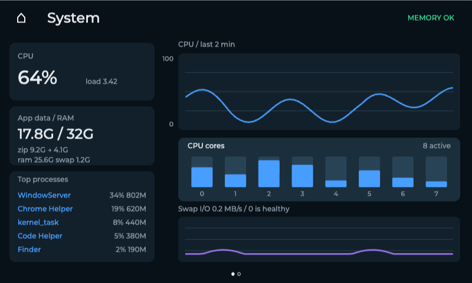
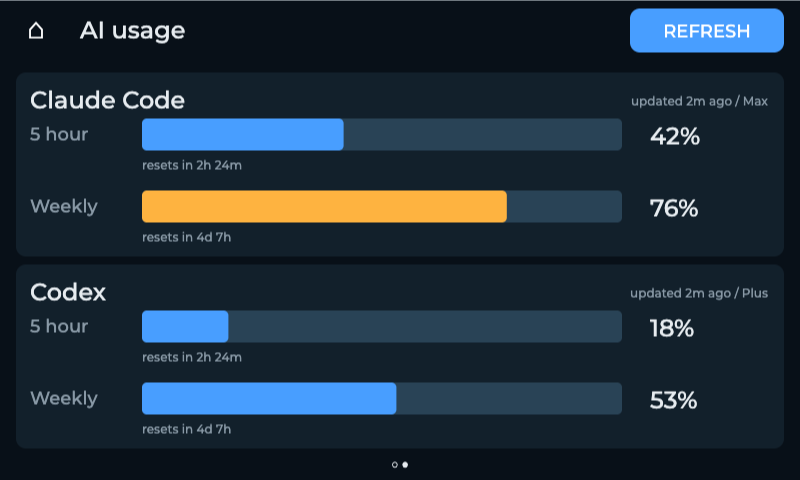
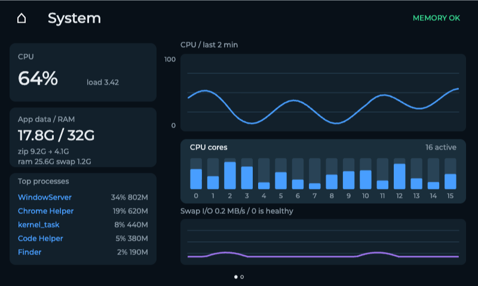

# Sysmon · ESP32 桌面监控屏 / ESP32 Desktop Monitor

[中文](#中文) · [English](#english)

## 界面预览 / UI preview

800×480 布局预览，图中数值为示例。/ 800×480 layout previews with sample data.

**系统监控 / System monitor**



**AI 用量 / AI usage**



**16 核布局 / 16-core layout**



## 中文

**Sysmon** 是一块放在桌上的 Mac 状态屏，运行在 Waveshare ESP32-S3-Touch-LCD-4.3C 上。开机进入 LVGL 应用首页，点击 **MONITOR** 图标后，可在两页触摸屏中查看电脑运行状态与 AI 编程工具的用量。首页保留了以后添加更多应用的位置。

- **系统监控页：**显示 CPU 总体与各核心负载、最近两分钟的曲线、内存占用与内存压力、压缩内存、交换空间活动，以及占用资源较多的进程。
- **AI 用量页：**显示 Claude Code 与 Codex 的五小时和每周用量、重置倒计时与数据更新时间。点按 **REFRESH** 可手动刷新；在 Monitor 内横向滑动切换页面，点按两页左上角的白色房子图标可返回应用首页。房子图标没有底色，但保留方便触摸的透明点击区域；点按空白区域可切换背光亮度。
- **本地运行：**Mac 用 Swift 采集系统指标，Node.js 提供局域网数据接口；ESP32 通过 Wi-Fi 每秒读取一次数据并绘制屏幕。Claude Code 凭据从 macOS 钥匙串读取，Codex 用量通过本机 Codex CLI 获取，凭据不写入项目源码。

### 项目结构

| 路径 | 说明 |
| --- | --- |
| `firmware-idf/` | 当前使用的 ESP-IDF / LVGL 固件、应用首页、双页面监控与屏幕触摸驱动。 |
| `previews/` | 800×480 布局预览与生成脚本；可在刷机前检查 8 核、16 核、AI 页和首页。预览数据是示例。 |
| `mac/` | Swift 系统采集器、Node 服务、浏览器状态页、串口配置工具和登录自启脚本。 |
| `firmware/sysmon/` | 早期 Arduino 版本及配套板级源码，留作参考；双页面功能请使用 `firmware-idf/`。 |

### 硬件与环境

- Waveshare ESP32-S3-Touch-LCD-4.3C，16 MB Flash、Octal PSRAM；Mac 与屏幕连接同一可互通的局域网。
- Mac 安装 Node.js 18+、Swift 编译器；编译固件需安装 ESP-IDF 5.5.x。ESP-IDF 依赖按 `firmware-idf/dependencies.lock` 下载。
- AI 用量需要 Mac 上已经登录 Claude Code，以及用 `~/.codex-usage` 作为账号目录登录的 Codex CLI。Claude Code 用量接口并非公开稳定 API，受限流时会显示错误并保留上次成功获取的数值。

### 开始使用

在仓库根目录编译并刷入当前固件；将端口替换为实际的 `/dev/cu.usbmodem*` 设备：

```sh
cd firmware-idf
idf.py set-target esp32s3
idf.py build
idf.py -p /dev/cu.usbmodemXXXX flash monitor
cd ..
```

在 Mac 上启动数据服务。设备的 **APPS → Wi-Fi** 可扫描网络并用触屏键盘输入密码；新网络取得 IP 后才会保存，连接失败会保留旧配置。Mac 地址仍通过 USB 串口设置一次，建议使用 Mac 的 `.local` 名称而不是可能变化的数字 IP：

```sh
node mac/server.mjs
# 在另一个终端运行：
node mac/configure.mjs
node mac/configure.mjs status
# 若设备以前保存的是数字 IP，只更新 Mac 名称而不改 Wi-Fi：
node mac/configure.mjs host
```

浏览器状态页位于 `http://localhost:8787/`；需要登录时自动启动服务，可运行 `node mac/install-agent.mjs`。服务监听局域网地址，适合在可信网络内使用。Wi-Fi 密码和主机配置存于设备 NVS，不在仓库中；编译文件、闪存备份和凭据也未纳入版本控制。驱动与字体中包含 Waveshare、Espressif 和 STMicroelectronics 的代码，保留了原有版权声明；本仓库没有为这些第三方文件统一重新授权。

Wi-Fi 页只显示网络名称与是否需要密码，不显示信号强弱。Monitor 保留原图标与操作。设备通过 `.local` 名称重新寻找 Mac；Mac 服务暂时不可用时会留在当前 Wi-Fi，不再因此切到另一个网络。Mac 与设备需要处在允许 mDNS 互通的网络中；即使 IP 在同一网段，不同 Wi-Fi 名称之间也可能屏蔽 mDNS。

如需退回以前的手绘界面，在单独的干净 checkout 中检出提交 `b6fb190`，按上述命令重新编译、刷机。刷写应用时不要擦除 NVS，以保留设备的 Wi-Fi 设置。

## English

**Sysmon** is a small desk display for the Waveshare ESP32-S3-Touch-LCD-4.3C. It boots into an LVGL app home screen: tap **MONITOR** to see Mac performance and AI coding subscription usage on two touch-screen pages. The launcher has room for future apps.

- **System page:** overall and per-core CPU load, a two-minute chart, memory usage and pressure, compressed memory, swap activity, and resource-heavy processes.
- **AI usage page:** Claude Code and Codex usage for the five-hour and weekly windows, reset countdowns, and data age. Tap **REFRESH** to update usage, swipe within Monitor to switch pages, or tap the white house icon in the upper left of either page to return to the app launcher. The icon has no colored background and retains a generous transparent touch target. Tap an unused area to cycle backlight brightness.
- **Local data flow:** a Swift sampler gathers Mac metrics, a Node.js server exposes them on the LAN, and the ESP32 reads and draws the data once a second over Wi-Fi. Claude Code credentials are read from macOS Keychain; Codex usage comes from the local Codex CLI. Credentials are never embedded in the source.

### Repository layout

| Path | Contents |
| --- | --- |
| `firmware-idf/` | Current ESP-IDF / LVGL firmware, app launcher, two monitor pages, and display/touch components. |
| `previews/` | 800×480 layout preview and generator for the 8-core, 16-core, AI, and launcher screens. Preview data is illustrative. |
| `mac/` | Swift sampler, Node server, browser status page, serial configurator, and login agent installer. |
| `firmware/sysmon/` | Earlier Arduino version and board sources for reference; build `firmware-idf/` for both pages. |

### Requirements

- A Waveshare ESP32-S3-Touch-LCD-4.3C with 16 MB flash and octal PSRAM; the Mac and display must share a reachable LAN.
- macOS with Node.js 18+ and the Swift compiler; ESP-IDF 5.5.x for firmware builds. ESP-IDF downloads the dependencies pinned in `firmware-idf/dependencies.lock`.
- For AI usage, a signed-in Claude Code installation and a signed-in Codex CLI using `~/.codex-usage` as its account directory. The Claude Code usage endpoint is undocumented and may rate-limit requests; on error the previous successful values remain visible with an error indicator.

### Getting started

From the repository root, build and flash the current firmware. Replace the serial port with your actual `/dev/cu.usbmodem*` device:

```sh
cd firmware-idf
idf.py set-target esp32s3
idf.py build
idf.py -p /dev/cu.usbmodemXXXX flash monitor
cd ..
```

Start the Mac server. Use **APPS → Wi-Fi** on the device to scan and join a network with its touch keyboard; new credentials are saved only after an IP address is acquired. Configure the Mac host once over USB serial, preferably with its `.local` name rather than a numeric IP that can change:

```sh
node mac/server.mjs
# Run these in a second terminal:
node mac/configure.mjs
node mac/configure.mjs status
# If the device still has a numeric Mac IP, update only its host:
node mac/configure.mjs host
```

The browser status page is at `http://localhost:8787/`. Run `node mac/install-agent.mjs` to start the server automatically at login. The server listens on the LAN; use it on a trusted network. Wi-Fi passwords and host settings live in device NVS, outside this repository. Build artifacts, flash backups, and credentials are also excluded. Display drivers and fonts include upstream work from Waveshare, Espressif, and STMicroelectronics with their original notices retained; this repository does not apply one blanket license to those third-party files.

The Wi-Fi page shows network names and password requirements without signal-strength indicators. The Monitor icon and controls are unchanged. The device re-resolves the Mac's `.local` name after a failed request and stays on the current Wi-Fi while the Mac service is unavailable. The LAN must allow device-to-Mac traffic and mDNS discovery; different Wi-Fi names may isolate mDNS even when their IP addresses share a subnet.

To restore the earlier hand-drawn UI, check out commit `b6fb190` in a separate clean checkout, then rebuild and flash using the commands above. Do not erase NVS when flashing the app; it stores the device's Wi-Fi settings.
